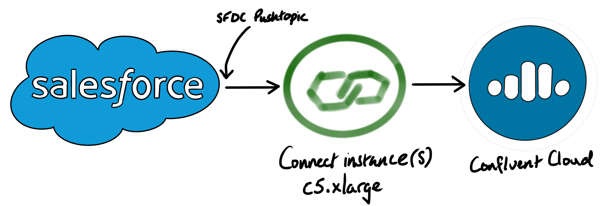

# self-managed Confluent Cloud Connect setup

There's a large ecosystem of sources and sinks (about 160 at the time of writing). The steps below walk through setting up a self-managed Connect instance, attached to a Confluent Cloud instance, with a Salesforce Pushtopic source.

Create a `c5.xlarge` Amazon Linux EC2 instance with 20GB of disk.

Install the JDK: `yum install java-1.8.0-openjdk`

Follow the first three steps in the [RHEL/CentOS installation docs](https://docs.confluent.io/current/installation/installing_cp/rhel-centos.html#systemd-rhel-centos-install)

Clean the caches and install the community bits:
* `yum clean all`
* `yum install confluent-community-2.12`

Make the connect service start automatically: `systemctl enable confluent-kafka-connect`

In the Confluent Cloud cluster, create these topics (replication factor = 3):
* connect-offsets (3 partitions)
* connect-status (1 partition)
* connect-configs (1 partition)

Install [HTTPie](https://httpie.org/):  
* `amazon-linux-extras install epel`
* `yum install httpie python3`

Clone this repo:
* `git clone  https://github.com/alexwoolford/cc-connect`
* `cd cc-connect`

Install [Jinja2](https://jinja.palletsprojects.com/en/2.11.x/) and ConfigParser on your local machine: `pip3 install Jinja2 configparser`

Add the Confluent Cloud and managed Schema registry connection properties to `ccloud.properties` and then run `./ccloud_render.py > /etc/kafka/connect-disributed.properties`

This will plug the properties into the Jinja2 template and output the resulting file to `/etc/kafka/connect-disributed.properties`.

Install the Confluent Hub client: `yum install confluent-hub-client`

## Salesforce Pushtopic Connector

In Salesforce, we run the following anonymous APEX snippet:

    PushTopic pushTopic = new PushTopic();
    pushTopic.Name = 'ContactUpdates';
    pushTopic.Query = 'SELECT id, firstname, lastname, accountid, email FROM contact';
    pushTopic.ApiVersion = 39.0;
    pushTopic.NotifyForOperationCreate = true;
    pushTopic.NotifyForOperationUpdate = true;
    pushTopic.NotifyForOperationUndelete = true;
    pushTopic.NotifyForOperationDelete = true;
    pushTopic.NotifyForFields = 'Referenced';
    insert pushTopic;

Install the salesforce connector: `confluent-hub install confluentinc/kafka-connect-salesforce:1.6.2`

Change the owner of the log location so it's writable by the `confluent-kafka-connect` service: `chown cp-kafka-connect:confluent /var/log/kafka/`

Create the `sfdc-contact-updates` topic in Confluent Cloud.

Start the Connect service: `systemctl start confluent-kafka-connect`

Create the SFDC connector:

    http PUT localhost:8083/connectors/sfdc-contact-updates/config <<< '
    {
        "confluent.topic.bootstrap.servers": "pkc-xxxxx.us-east1.gcp.confluent.cloud:9092",
        "confluent.topic.replication.factor": "3",
        "connector.class": "io.confluent.salesforce.SalesforcePushTopicSourceConnector",
        "kafka.topic": "sfdc-contact-updates",
        "name": "sfdc-contact-updates",
        "salesforce.consumer.key": "********",
        "salesforce.consumer.secret": "********",
        "salesforce.initial.start": "all",
        "salesforce.object": "Contact",
        "salesforce.password": "********",
        "salesforce.password.token": "********",
        "salesforce.push.topic.name": "ContactUpdates",
        "salesforce.username": "alex@woolford.io",
        "tasks.max": "1",
        "confluent.topic.bootstrap.servers": "pkc-xxxxx.us-east1.gcp.confluent.cloud:9092",
        "confluent.topic.sasl.jaas.config": "org.apache.kafka.common.security.plain.PlainLoginModule   required username=\"********\"   password=\"********\";",
        "confluent.topic.security.protocol": "SASL_SSL",
        "confluent.topic.sasl.mechanism": "PLAIN"
    }'

You'll need to customize the properties above to match your own Salesforce and Confluent Cloud properties.
